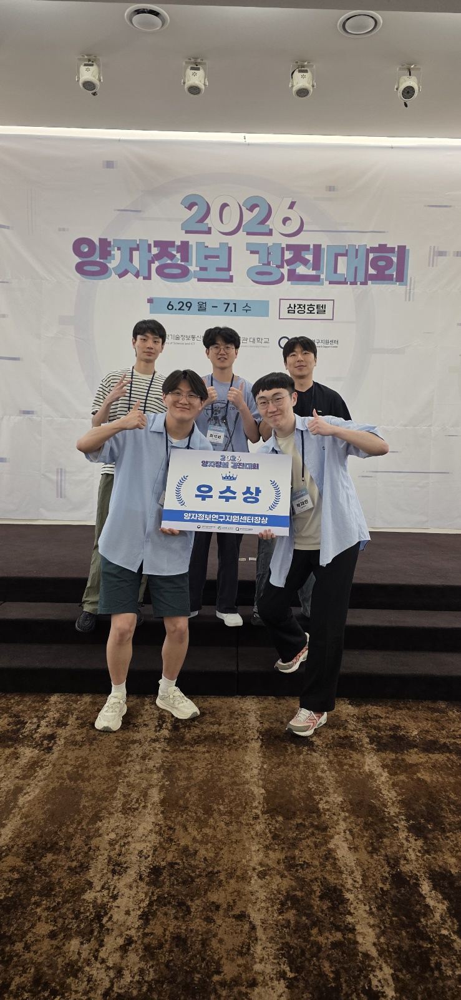
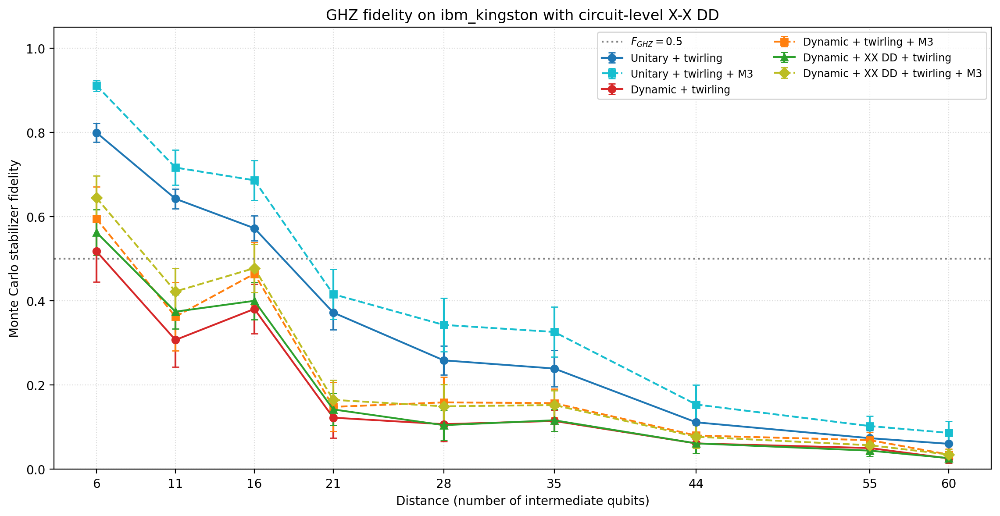
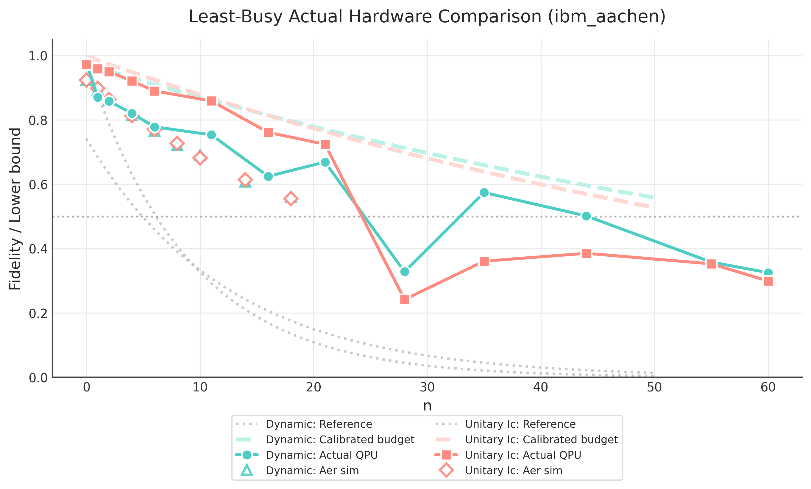

# Korea Quantum Hackathon 2026 — Team Quantum Joa (양자조아)

**2026 양자정보경진대회 · Assigned Problem (4): Dynamic Circuits**
29 June – 1 July 2026 · Samjung Hotel, Seoul

🏆 **Excellence Award (우수상)**, Director's Award of the Quantum Information Research Support Center (양자정보연구지원센터장상)

<p align="center">
  
</p>

**Team members:** Hyungmin Lim, Jeongbin Jo, Junghwan Kim, Jaemin Park, Seokwon Choi

📑 Slides: [Presentation_QuantumJoa.pdf](Presentation_QuantumJoa.pdf) · 📄 Problem statement: [2026 양자정보경진대회 지정문제(4) Dynamic circuits.pdf](<2026 양자정보경진대회 지정문제(4) Dynamic circuits.pdf>)

---

## About the Hackathon

The **Korea Quantum Hackathon 2026 (2026 양자정보경진대회)** is a national quantum information competition hosted by the **Ministry of Science and ICT (과학기술정보통신부)** of the Korean government and organized by **Sungkyunkwan University (SKKU, 성균관대학교)** and the **Quantum Information Research Support Center (양자정보연구지원센터)**. It ran for three days, from 29 June to 1 July 2026, with 20 teams (about 86 students) that had passed the preliminary round. Our team worked on **Assigned Problem (4): Dynamic Circuits**.

🔗 Official awards announcement: [2026 양자정보경진대회 수상팀 및 단체사진 안내](https://qhackathon.kr/2026/?p=0401&idx=5550)

---

## Overview

Dynamic circuits use **mid-circuit measurements and classical feed-forward** to replace deep unitary sub-circuits with shallower, measurement-based equivalents. On superconducting hardware with limited connectivity (heavy-hex on Heron, square lattice on Nighthawk), long-range two-qubit operations normally need SWAP chains; dynamic circuits can replace them with constant-depth constructions.

We studied where dynamic circuits help and where they don't, using simulation, fake backends and real IBM Quantum hardware:

| # | Topic | Main result |
|---|-------|-------------|
| 1 | GHZ state preparation, O(n) unitary vs O(1)-depth dynamic | Verified with stabilizer-sampled fidelity. On `ibm_kingston` there was no crossover, consistent with Bäumer et al. |
| 2 | Hardware-aware long-range CNOT via gate teleportation | Shortest bus-route search on heavy-hex (`ibm_yonsei`) and 2D lattice (`ibm_miami`), plus a resource comparison |
| 3 | Effect of noise on the dynamic long-range CNOT | Analytic lower bound on process fidelity shows a **crossover at distance ≈ 10**. Readout error dominates the dynamic circuit; CNOT depolarizing noise dominates the unitary one |
| 4 | Dynamic circuits inside larger algorithms | Dynamic QFT/QPE scale better after transpilation. Measurement-uncompute MCZ and dynamic Grover beat their unitary versions |

---

## Problem 1 — GHZ State Preparation with Dynamic Circuits

- **Circuits:** a unitary `H + CX` ladder with depth O(n), and a dynamic GHZ with constant depth that uses mid-circuit measurement and feed-forward (Bäumer et al., Fig. 5 / App. A.2).
- **Fidelity:** estimated by Monte Carlo sampling of the GHZ stabilizer group (one X-type and n−1 Z-type generators).
- **Noiseless check:** n = 7, 32 sampled stabilizers, 2048 shots on `AerSimulator`, which confirms the circuits are correct.
- **Noisy simulation:** 4–40 qubits with 1q/2q/reset/readout error = 0.001/0.01/0.01/0.02, using M3 readout mitigation and Pauli twirling.
- **Hardware (`ibm_kingston`):** distances 6–60 with M3, Pauli twirling and dynamical decoupling, 12 sampled stabilizers and 1024 shots.
- **Conclusion:** fidelity stays above 1/2 up to about 18 qubits. Dynamic did not overtake unitary because the extra measurements and CX gates cost more than the depth they save, which matches the reference paper.

<p align="center">
  
</p>

## Problem 2 — Hardware-Aware Long-Range CNOT (Gate Teleportation)

- **Dynamic LRCX:** Bell-pair preparation, Bell-basis measurement and feed-forward (Bäumer et al., Fig. 4).
- **Unitary baseline:** Strategy Ic (4n+1 CNOTs), chosen because its idle time does not grow quadratically like the other strategies.
- **Shortest bus route finding** on real coupling maps: distance 19 on `ibm_yonsei` (heavy-hex) and distance 28 on `ibm_miami` (2D lattice).
- Theoretical and transpiled resource comparison: depth, 2Q gate count and mid-circuit measurements.

## Problem 3 — Impact of Noise on the Dynamic Long-Range CNOT

- Built a **lower bound on the combined process fidelity** (via the Choi–Jamiołkowski isomorphism) from three noise sources:
  - **Thermal relaxation (T1/T2):** idle bound from a Pauli–Lindblad model.
  - **Depolarizing noise:** derived from the hardware CNOT gate fidelity.
  - **Readout error:** a classical measurement-error model.
- **Crossover detected:** beyond distance ≈ 10 the dynamic circuit outperforms the unitary one.
- **Dominant error (`fake_brisbane`):** readout error for the dynamic circuit; depolarizing and thermal noise for the unitary circuit. A λ_CNOT × λ_meas sweep confirms this.
- **Real hardware:** the crossover is also observed. Some points fall below the bound because error rates vary from qubit to qubit.

<p align="center">
  
</p>

## Problem 4 — Dynamic Circuits inside Larger Algorithms (Open Problem)

### 4.1 Dynamic QFT & Dynamic QPE
- **Dynamic QFT:** replaces controlled-phase gates with semi-classical feed-forward (Bäumer et al., *Quantum Fourier Transform using Dynamic Circuits*). It beats the unitary QFT on `fake_fez` and gives lower depth and 2Q count after transpilation.
- **Dynamic QPE:** Lloyd QPE with a dynamic IQFT (arXiv:1910.11696). Unitary wins at n = 4, but grid searches on `fake_yonsei` and `fake_fez` show the dynamic version scales better, with almost constant depth after transpilation.

### 4.2 Dynamic Multi-Controlled Gates & Dynamic Grover Search
- **Measurement-uncompute MCZ:** AND-tree ancillas are measured in the X basis and the leftover phase is corrected by feed-forward. This turns CCX uncomputation into a simple dynamic CZ.
- MCZ fidelity (Monte Carlo Pauli stabilizers) on a noise model and on `ibm_fez`: **dynamic beats unitary**, with fewer resources.
- **Dynamic Grover search** using the dynamic MCZ oracle (target `1010…10`): **dynamic beats unitary**.
- **Generalization, spooky pebbling:** the same "ghost/exorcise" idea saves ancillas on any irreversible computation graph.

### Extras
- Repetition-code QEC with dynamic circuits (`p4_qec.ipynb`).
- Future work: dynamic-sampling HHL (experimental, unstable).

---

## Error Mitigation Used

- **M3:** readout mitigation that solves a reduced linear system over the most likely bitstrings.
- **Pauli twirling:** turns coherent errors into stochastic noise.
- **Dynamical decoupling:** pulse sequences that suppress idle errors (hardware runs only).

---

## Repository Structure

```
.
├── Presentation_QuantumJoa.pdf          # Final presentation slides
├── 2026 양자정보경진대회 지정문제(4) ...pdf  # Problem statement
├── assets/                              # Award photos
└── codes/
    ├── problem1/   # GHZ: src/ghz_circuit.py, src/dynamic_gates.py, p1.ipynb, figures/
    ├── problem2/   # Long-range CNOT teleportation: p2.ipynb, p2_and_3*.ipynb, dynamic_ghz.ipynb
    ├── problem3/   # Noise analysis: problem3*.ipynb, p3_fakebackend.ipynb, p3_noise_model.ipynb
    └── problem4/   # dynamic_qft.ipynb, dynamic_qpe.{py,ipynb}, problem4.ipynb (MCZ),
                    # problem4_grover.ipynb, p4_qec.ipynb, qsp_core.py, run_simulation.ipynb
```

### Requirements
Python 3.10+, `qiskit` (2.x), `qiskit-aer`, `qiskit-ibm-runtime`, `mthree`, `numpy`, `matplotlib`.
Hardware notebooks need an IBM Quantum account. Do not commit API keys.

```python
from codes.problem1.src import unitary_ghz_circuit, dynamic_ghz_circuit
```

---

## References

1. E. Bäumer et al., *Efficient Long-Range Entanglement Using Dynamic Circuits*, PRX Quantum **5**, 030339 (2024), [arXiv:2308.13065](https://arxiv.org/abs/2308.13065)
2. E. Bäumer et al., *Quantum Fourier Transform Using Dynamic Circuits*, [arXiv:2403.09514](https://arxiv.org/abs/2403.09514)
3. Quantum phase estimation (Lloyd / semi-classical IQFT), [arXiv:1910.11696](https://arxiv.org/abs/1910.11696)
